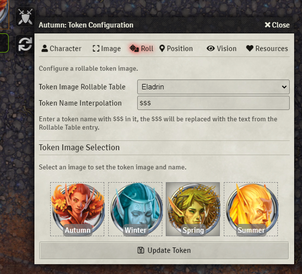

# Rollable Tokens

Link a token to a Rollable Table in order to randomize the token image and name, or select the image and name from among the list of options.

## How To Use

Start by creating a new Rollable Table. Populate this table with text results, and assign each result one of the token images you want to include. Optionally, enter text into the text field to be dynaically replaced into the token name.

Next, open the config for the token you want to link, and select the new "Roll" tab at the top. Here, choose from the list of Rollable Tables the new table that you have created and save the token. Open the config again, and return to the "Roll" tab to see the additional options.

The name interpolation field allows you to enter a name that will be substituted for the token's name whenever the image is changed with this module. You can use the special string `$$$` (three dollar signs) to denote a part of the string which will have a substitution performed on it. The `$$$` will be replaced with the text from the Roll Table result that corresponds to the image you have selected. For example, if you enter "The $$$ Magician" into this field, and your table results include "evil", "good", "foolish", and "clever", then you choose or randomize the token resulting in the "foolish" image, the name of the token will be "The foolish magician."

The Token Image Selection area allows you to choose a particular image to apply from the options provided in the table. This allows you to quickly change the icon of a token to one from a set list.

The token HUD has also been upgraded, there is now a "randomize" button 🔁 which will draw a result from the Rollable Table and appl the appropriate image and name at random. By default this also sends a Roll Table result card to the chat, however you can disable this chat message in the module settings.

## Planned Features

The following is a non-exhaustive list of features I plan to add to this module:
- A quick way to open the linked table from the token config
- Multiple HUD control modes
  - Random
  - Sequential
  - Image selector
- Display the images in the image selection area in the same order as their rollable order in the table (allowing for custom image order).
- UI Improvements
- Better UX to avoid opening and closing the token config repeatedly.
- Ability to automatically roll a token upon creation.
- A helper tool to quickly create a new table from a set of image.